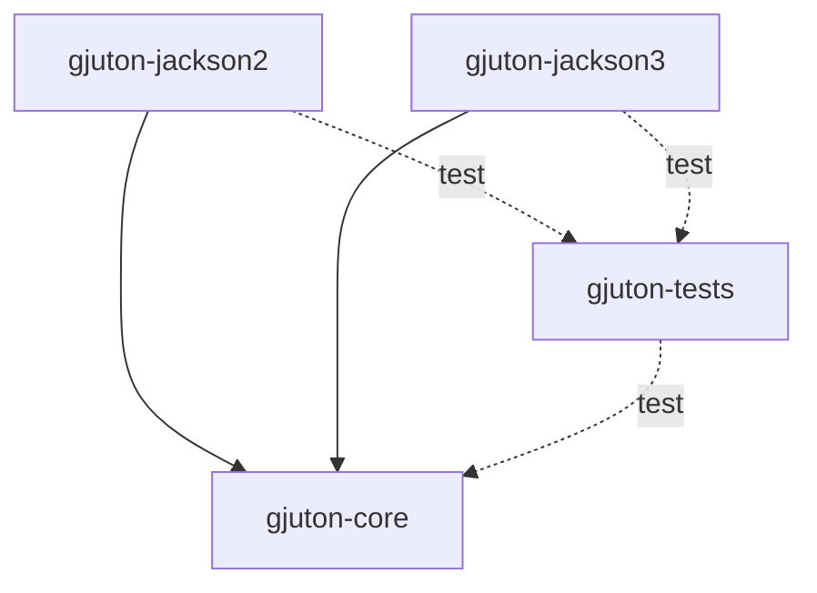
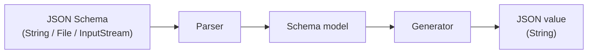
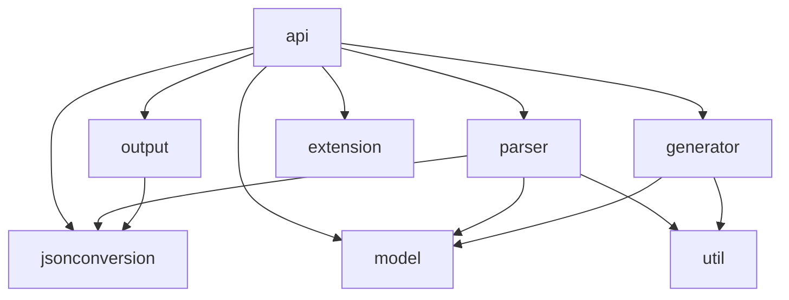

# Architecture

Gjuton turns a JSON Schema into valid JSON test data. Internally it is a three-phase pipeline: a schema document is
parsed into a model, and the model is walked to produce a JSON value.

## Maven modules

Jackson 2 (`com.fasterxml.jackson`) and Jackson 3 (`tools.jackson`) are separate libraries, and no class can name both.
Gjuton therefore ships the generator once and the Jackson binding twice:

| artifact          | contains                                             |
|-------------------|------------------------------------------------------|
| `gjuton-core`     | everything but the JSON binding; no Jackson databind |
| `gjuton-jackson2` | the Jackson 2 binding                                |
| `gjuton-jackson3` | the Jackson 3 binding                                |

A consumer depends on one flavour artifact, which brings `gjuton-core` with it. On its own `gjuton-core` cannot read or
write JSON, and says which artifact to add.



`gjuton-tests` holds the shared test suite and is not published. It compiles the suite and runs only the architecture
rules itself; each flavour runs the suite against its own Jackson. Neither flavour depends on the other, so the two runs
go in parallel. Test-scoped dependencies are not inherited, which is what keeps each flavour off the other's classpath.

Because one compiled suite runs under both, no test class in `gjuton-tests` may name a Jackson type — an ArchUnit rule
enforces it; those that must, such as the YAML-reading OpenAPI tests, live in `gjuton-jackson2`. Each flavour asserts
with a validator on its own Jackson: networknt `json-schema-validator` 2.x and 3.x are the same API over different
majors.

## Pipeline

1. **Parser** — reads a JSON Schema document into a tree of plain `Map`s and
   `List`s, then binds that tree to the internal schema model. Both steps go through `JsonConverter`, so the parser
   names no JSON library. The mapping itself is expressed as annotations on the model classes. A few constructs cannot
   be expressed that way, and for those the parser rewrites the tree before binding — the `"type": ["string", "null"]`
   shorthand becomes an explicit `oneOf`, for example. Rewriting is a last resort: it moves the shape a schema may take
   out of the model classes, which is where a reader looks for it.
2. **Model** — Java classes representing schema constructs (type, constraints,
   `$ref`, combining keywords, and so on). Model classes carry the annotations that drive deserialization, but only
   those a Jackson version does not change; the rest are attached by a flavour module (see [Extensions](#extensions)).
3. **Generator** — walks the model and produces a JSON value as a string.



The public API accepts a schema as a `String`, `File`, or `InputStream` and returns a plain `String` — no third-party
types are exposed. Convenience overloads write the result to an `OutputStream`, `Writer`, or `File` instead.

## Schema model design

Cross-cutting JSON Schema keywords (`enum`, `const`, `if`/`then`/`else`, and the combining keywords) are fields on the
`Schema` base class rather than separate schema types. Type-specific properties (for example `minimum` on integers) live
on the concrete subclasses. The generator checks the cross-cutting keywords before dispatching on type.

## Generation strategy

The generator supports two strategies, selected by `GenerationMode`. The default
`RANDOM` mode emits random valid values. The opt-in `EXHAUSTIVE` mode prioritises values that are likely to expose bugs
in the system under test: for each type it emits deterministic "trouble-prone" values first — an empty string for
strings; the minimum, maximum, and zero for integers — and then random valid values. This trouble-prone-first ordering
is what "boundary-value exhaustiveness" means in issue acceptance criteria.

## Extensions

An extension injects behaviour into `gjuton-core` that is not available to it at compile time. Extensions are found on
the classpath at start-up and register what they provide in a `ServiceLocator`, where `gjuton-core` resolves it at
runtime.

Today this is what supplies Jackson: a flavour module registers a `JsonConverter`, so `gjuton-core` reads and writes
JSON without depending on Jackson itself.

## Package layering

```
io.github.gjuton
├── api          public API — everything a consumer imports
├── errors       exception types (public, thrown from internal code)
└── internal     implementation detail, not part of the public contract
    ├── extension      extension discovery and the services they register
    ├── jsonconversion JSON reading, binding and writing, library-neutral
    ├── parser   JSON → schema model
    ├── model    schema model classes
    ├── generator model → generated value tree
    ├── output   generated value tree → JSON string or bound instance
    └── util     general-purpose utilities (math, random, string, functional)
```

Allowed dependencies between packages (enforced by ArchUnit — violations fail
`mvn test`):

```
api            — entry point; may access all layers
parser         — may only access jsonconversion, model, errors and util
generator      — may only access model, errors, and util
output         — may only access jsonconversion and errors
jsonconversion — may only access errors
extension      — leaf; no dependencies on other internal packages; only `api` may access it
model          — leaf; no dependencies on other internal packages
util           — leaf; no dependencies on other internal packages
errors         — leaf; no dependencies on other packages
```

Jackson databind is confined to the flavour modules. Within `gjuton-core`,
`model` carries Jackson *annotations* — the one artifact both Jackson majors share — and no other package names Jackson
at all. Consumers must only import from `api`, never from `internal` directly.

The `api`, `parser`, `generator`, and `output` packages and the ones they build on:



`extension`, `model`, and `util` are leaves — they have no outgoing dependencies on other internal packages. `errors` is a
leaf too, and is left out of the graph: every package may throw, so every package depends on it.
